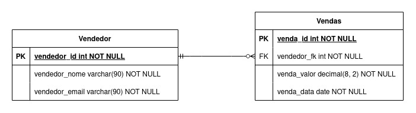

<!-- Banner -->
<h1 align="center">Spike Store</h1>
<p align="center">🛒🌵 Sistema para cadastro e gerenciamento de vendas</p>

<!-- Badges -->

<h4 align="center"> 🚧  Em construção...  🚧</h4>

<p align="center">
    <a href="#objetivo">Objetivo</a> •
    <a href="#roadmap">Roadmap</a> •
    <a href="#prototipacao">Prototipação</a> •
    <a href="#tecnologias">Tecnologias</a> •
    <a href="#executando_projeto">Executando projeto</a> •
    <a href="#autor">Autor</a>
</p>

<div id="objetivo">
    <h2>Objetivo</h2>
    <p></p>
</div>
<div id="roadmap">
    <h2>Roadmap</h2>
    <h3>Funcionalidades</h3>
    <ul>
        <li>Cadastro de vendedores</li>
        <li>Listagem de vendedores</li>
        <li>Atualização de vendedores</li>
        <li>Exclusão de vendedores</li>
        <li>Cadastro de vendas</li>
        <li>CListagem de vendas</li>
    </ul>
    <h3>Banco de Dados (DER)</h3> 
    <p align="center">
<<<<<<< HEAD
        
=======
        
>>>>>>> 5255dc27168e284cffe039e8612026fc810217fb
    </p>
    <h3>Rotas</h3>
    <h3>Teste unitários</h3>
</div>
<div id="prototipacao">
    <h2>Prototipação</h2>
    <h3>Wireframe</h3>
    <h3>Figma</h3>
</div>
<div id="tecnologias">
    <h2>Tecnologias</h2>
    <p>As seguintes ferramentas foram usadas na construção do projeto:</p>
    - [Laravel](https://expo.io/)
    - [PHP 8.2](https://nodejs.org/en/)
    - [Composer](https://pt-br.reactjs.org/)
    - [Javascript](https://nodejs.org/en/)
    - [Mysql](https://reactnative.dev/)
</div>
<div id="executando_projeto">
    <h2>Executando o projeto</h2>
    <h3>Pré-requisitos</h3>
    <p>Antes de mais nada, você precisará ter instalado em sua máquina as seguintes ferramentas:</p>
    [PHP 8.2](https://www.php.net/), [Composer](https://getcomposer.org), [Mysql](https://www.mysql.com/).
    <h3>Preparando ambiente</h3>
    <p>Migrations e Arquivos SQL</p>
    <h3>Rodando a aplicação</h3>

```bash
# Clone este repositório
$ git clone <https://github.com/tgmarinho/nlw1>

# Acesse a pasta do projeto no terminal/cmd
$ cd nlw1

# Vá para a pasta server
$ cd server

# Instale as dependências
$ npm install

# Execute a aplicação em modo de desenvolvimento
$ npm run dev:server

# O servidor inciará na porta:3333 - acesse <http://localhost:3333>
```
</div>
<div id="autor"></div>
