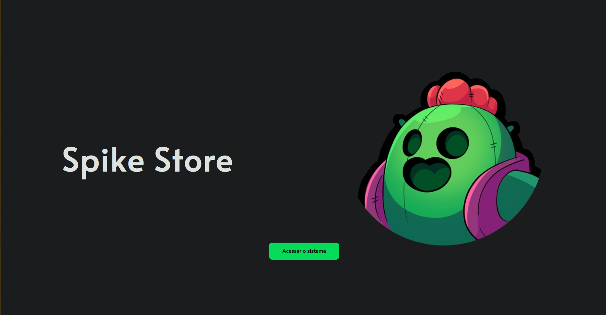
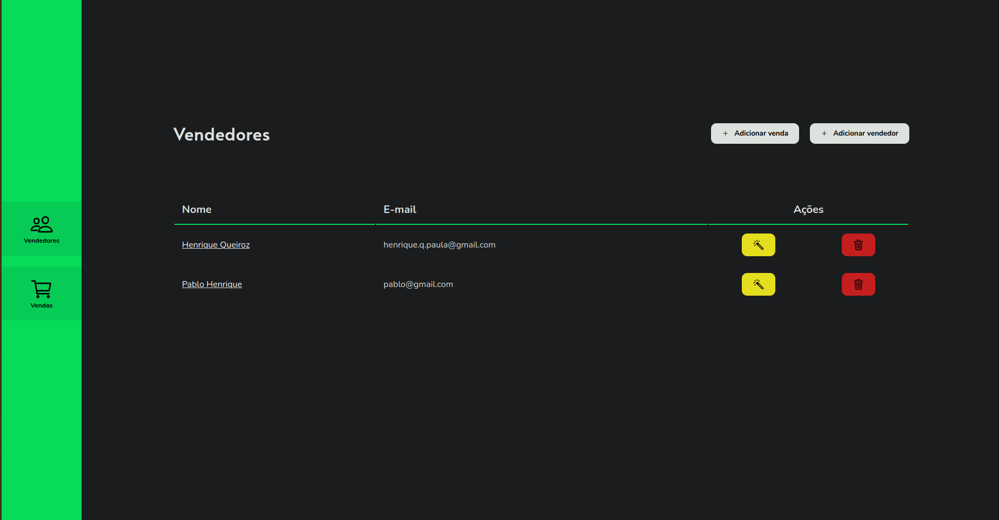
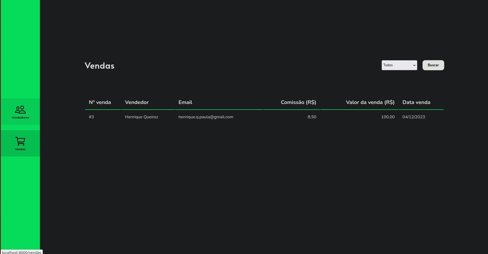
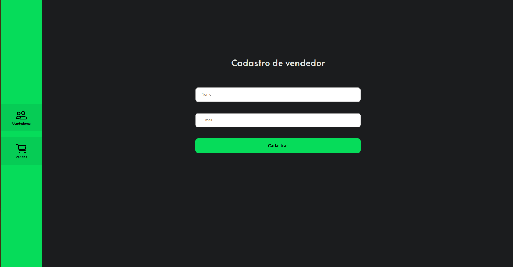

<!-- Banner -->
<p align="center">
    
</p>
<h1 align="center">Spike Store</h1>
<p align="center">🛒🌵 Sistema para cadastro e gerenciamento de vendas</p>

<!-- Badges -->

<h4 align="center">✅  Finalizado  ✅</h4>

<p align="center">
    <a href="#objetivo">Objetivo</a> •
    <a href="#roadmap">Roadmap</a> •
    <a href="#prototipacao">Prototipação</a> •
    <a href="#tecnologias">Tecnologias</a> •
    <a href="#executando_projeto">Executando projeto</a>
</p>

<div id="objetivo">
    <h2>Objetivo</h2>
    <p>A "Spike Store" é um projeto criado como parte de um teste técnico de desenvolvimento de software<, o objetivo era o desenvolvimento de uma plataforma para cadastro de vendedores e suas respectivas vendas, o desafio explorou tecnologias como PHP e MySQL, exigindo funcionalidade como um CRUD (Create, Read, Update e Delete) de informações, assim como agendamento de rotinas.</p>
</div>
<div id="roadmap">
    <h2>Roadmap</h2>
    <h3>Funcionalidades</h3>
    <p>Era necessário que o projeto possui as seguintes funcionalidades:</p>
    <ul>
        <li>[Create] - Cadastro de vendedores;</li>
        <li>[Read] - Listagem de vendedores;</li>
        <li>[Update] - Atualização de vendedores;</li>
        <li>[Delete] - Exclusão de vendedores;</li>
        <li>Cadastro de vendas;</li>
        <li>Listagem de vendas;</li>
        <li>Calculo de comissão de venda;</li>
        <li>Rotina de envio de relatórios diários.</li>
    </ul>
    <h3>Banco de Dados (DER)</h3> 
    <p align="center">
        
    </p>
</div>
<div id="prototipacao">
    <h2>Prototipação</h2>
     <p align="center">
        <br>
        <br>
        <br>
        
     </p>
</div>
<div id="tecnologias">
    <h2>Tecnologias</h2>
    <p>As seguintes ferramentas foram usadas na construção do projeto:</p>
    <ul>
        <li><a href="https://laravel.com/">[Laravel]</a></li>
        <li><a href="https://www.php.net/">[PHP 8.2]</a></li>
        <li><a href="https://getcomposer.org">[Composer]</a></li>
        <li><a href="https://developer.mozilla.org/en-US/docs/Web/JavaScript">[Javascript]</a></li>
        <li><a href="https://www.mysql.com/">[Mysql]</a></li>
    </ul>
</div>
<div id="executando_projeto">
    <h2>Executando o projeto</h2>
    <h3>Pré-requisitos</h3>
    <p>Antes de mais nada, você precisará ter instalado em sua máquina as seguintes ferramentas:<br>
    <a href="https://www.php.net/">[PHP 8.2]</a>, <a href="https://getcomposer.org">[Composer]</a>, <a href="https://www.mysql.com/">[Mysql]</a>.</p>
    <h3>Preparando ambiente</h3>
<p>Crie um arquivo .env com os seguintes moldes:<br>
(Altere se necessários as configurações de banco e envio de e-mail)</p>
    
```bash
APP_NAME=Spike_Store
APP_ENV=local
APP_KEY=base64:FYvJ2tNV0q0GxsqOE7t547Yb1xihITBAKAEIdUSbwe8=
APP_DEBUG=true
APP_URL=http://localhost

LOG_CHANNEL=stack
LOG_DEPRECATIONS_CHANNEL=null
LOG_LEVEL=debug

DB_CONNECTION=mysql
DB_HOST=localhost
DB_PORT=3306
DB_DATABASE=spike_store
DB_USERNAME=root
DB_PASSWORD=

BROADCAST_DRIVER=log
CACHE_DRIVER=file
FILESYSTEM_DISK=local
QUEUE_CONNECTION=sync
SESSION_DRIVER=file
SESSION_LIFETIME=120

MEMCACHED_HOST=127.0.0.1

REDIS_HOST=127.0.0.1
REDIS_PASSWORD=null
REDIS_PORT=6379

MAIL_MAILER=smtp
MAIL_HOST=mailpit
MAIL_PORT=1025
MAIL_USERNAME=null
MAIL_PASSWORD=null
MAIL_ENCRYPTION=null
MAIL_FROM_ADDRESS="hello@example.com"
MAIL_FROM_NAME="${APP_NAME}"

AWS_ACCESS_KEY_ID=
AWS_SECRET_ACCESS_KEY=
AWS_DEFAULT_REGION=us-east-1
AWS_BUCKET=
AWS_USE_PATH_STYLE_ENDPOINT=false

PUSHER_APP_ID=
PUSHER_APP_KEY=
PUSHER_APP_SECRET=
PUSHER_HOST=
PUSHER_PORT=443
PUSHER_SCHEME=https
PUSHER_APP_CLUSTER=mt1

VITE_APP_NAME="${APP_NAME}"
VITE_PUSHER_APP_KEY="${PUSHER_APP_KEY}"
VITE_PUSHER_HOST="${PUSHER_HOST}"
VITE_PUSHER_PORT="${PUSHER_PORT}"
VITE_PUSHER_SCHEME="${PUSHER_SCHEME}"
VITE_PUSHER_APP_CLUSTER="${PUSHER_APP_CLUSTER}"
```

<h3>Rodando a aplicação</h3>

```bash
# Clone este repositório
$ git clone <https://github.com/HenriqueQueirozz/spike-store.git>

# Acesse a pasta do projeto
$ cd spike-store

# Instale as dependências
$ composer install

# Em seu banco de dados crie a seguinte tabela
create database spike_store;

# Caso não tenha executado as querys descritas no tópico anterior, execute as migrations
$ php artisan migrate:fresh

# Execute a aplicação
$ php artisan serve

# O servidor iniciará na porta:8000 - acesse <http://localhost:8000>
```
</div>
